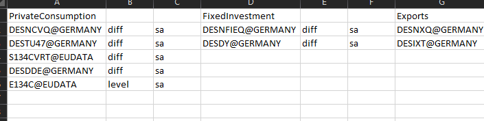
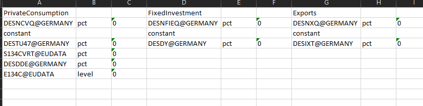
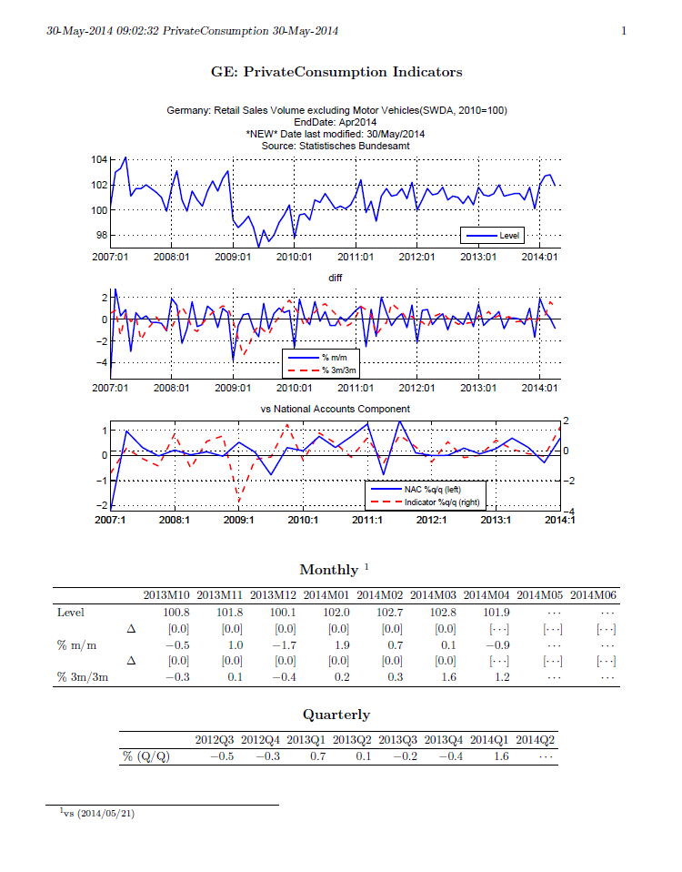
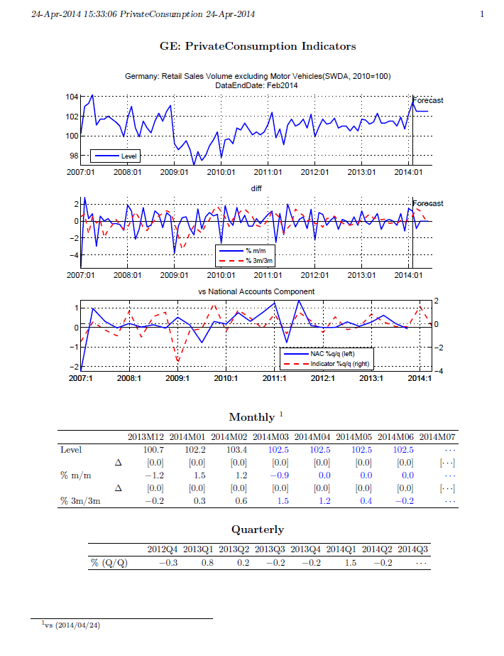

# monitoring-toolbox
The forecasting framework I created for weekly monitoring of economic data at the IMF. Project write-up available [here](https://www.kevinkeithley.me/creating-a-near-term-economic-growth-forecasting-framework).

## Software Requirements
- Matlab R2012 or later
- IRIS toolbox - [on github](https://github.com/IRIS-Solutions-Team/IRIS-Toolbox)
- Matlab Datafeed Toolbox with subscription to the Haver analytics database

## Basic Use

Included in the repository is an example of using the monitoring-toolbox to pull, save, and visualize economic data for Germany, as well as basic data analysis and OLS forecasting. Within the Germany folder is a file driver.m for typical weekly use.

### Inputs

**Data/cc_definitions.xslx** (where cc is the chosen two-letter country code, in this case, GE)

- For plotting historical data, contains Haver tickers organized by national accounts components (the lhs variables of interest for forecasting growth)

- For running OLS regressions, contains regression and lag structure

### Outputs

**Reports**

- Historical data plots and tables by national accounts component

- Forecast Reports

**Data**

- Data definitions file for all series
- Saves historical data as vintages
- Saves assumptions data as vintages
